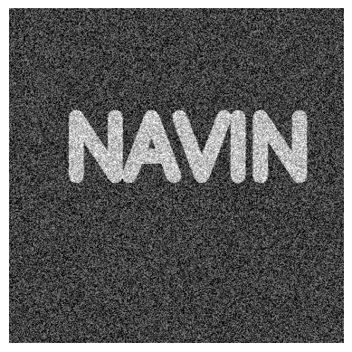
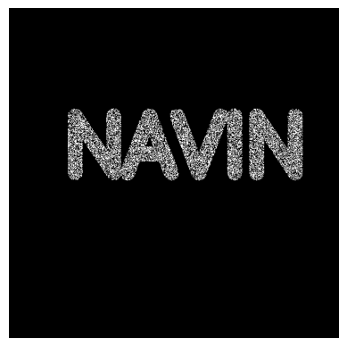

# OPENING--AND-CLOSING
## Aim
To implement Opening and Closing using Python and OpenCV.

## Software Required
1. Anaconda - Python 3.7
2. OpenCV

## Algorithm:
### Step1:
 Import the necessary packages


### Step2:
 Give the input text using cv2.putText()


### Step3:
 Perform opening operation and display the result


### Step4:
 Similarly, perform closing operation and display the result

## Program:

``` Python
import cv2
import numpy as np
from matplotlib import pyplot as plt

img = np.zeros((600, 600))
font = cv2.FONT_HERSHEY_SIMPLEX
cv2.putText(img, 'NAVIN', (100,300), font,5, (255, 255, 255), 25, cv2.LINE_AA)
plt.imshow(img, cmap='gray')
plt.axis('off')
plt.show()

kernel = np.ones((5,5),np.uint8)
kernel

white_noise=np.random.randint(low=0,high=2,size=(600,600))
white_noise = white_noise*255
noise_img = white_noise+img
plt.imshow(noise_img, cmap='gray')
plt.axis('off')
plt.show()

opening = cv2.morphologyEx(noise_img, cv2.MORPH_OPEN, kernel)
plt.imshow(opening, cmap='gray')
plt.axis('off')
plt.show()

black_noise = np.random.randint(low=0,high=2,size=(600,600))
black_noise = black_noise* -255
noise_img2 = black_noise + img
noise_img2[noise_img2==-255] = 0
plt.imshow(noise_img2, cmap='gray')
plt.axis('off')
plt.show()

closing = cv2.morphologyEx(noise_img2, cv2.MORPH_CLOSE, kernel)
plt.imshow(closing, cmap='gray')
plt.axis('off')
plt.show()


```
## Output:

### Display the input Image

 



### Display the result of Opening


### Display the result of Closing


## Result
Thus the Opening and Closing operation is used in the image using python and OpenCV.